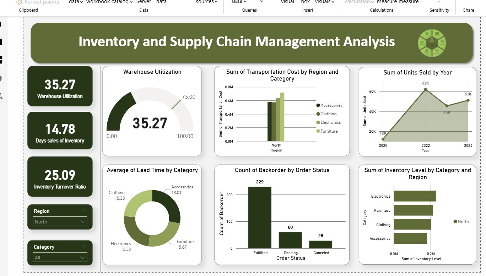

# Inventory & Supply Chain Analysis Dashboard

## Overview

This project is an interactive Power BI dashboard developed to analyze inventory and supply chain performance.

## KPIs

- Warehouse Utilization
- Inventory Turnover Ratio
- Days Sales of Inventory
- Transportation Cost
- Lead Time
- Backorders
- Inventory Level
- Units Sold

## Tools Used

- Power BI
- Power Query
- DAX

## Dashboard

## Business Insights

- Monitor warehouse utilization.
- Track inventory turnover.
- Analyze transportation costs.
- Identify backorders.
- Compare inventory levels across categories.
